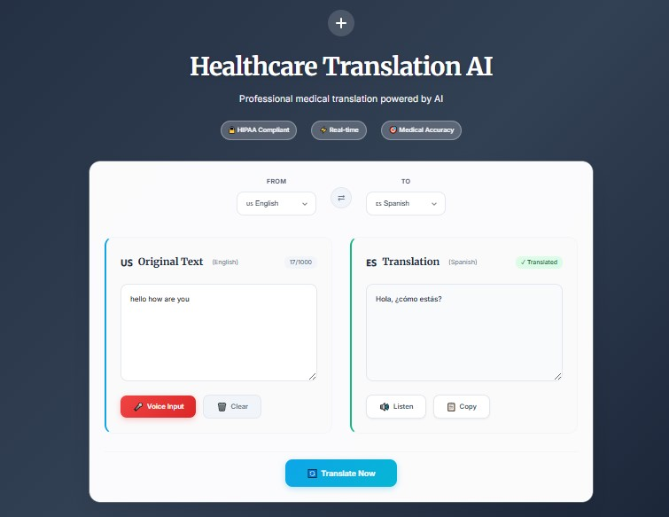

# 🏥 Translation Web App

A **real-time multilingual translation tool** that leverages Generative AI, speech recognition, and text-to-speech to make communication seamless across languages.


Built with **React (frontend)**, **FastAPI (backend)**, and **Hugging Face NLP models**, deployed on **Vercel** and **Railway**.  
Includes **speech-to-text** using the **Web Speech API** and **text-to-speech** using the **SpeechSynthesis API** for a fully interactive voice experience.
---

## 🚀 Features

- 🎙 **Voice-to-Text with Generative AI** – Converts spoken medical terms into accurate transcripts  
- 🌐 **Real-Time Translation** – AI-powered translations using Helsinki-NLP models  
- 🔊 **Audio Playback** – Listen to translations with natural-sounding text-to-speech  
- 📱 **Mobile-First UI** – Fully responsive design for desktop and mobile use  
- 🛡 **Privacy-Friendly** – No storage of patient speech or translation data  

---

## 🔧 Technologies Used

- **Frontend:** React, Web Speech API, SpeechSynthesis API  
- **Backend:** FastAPI, Python, Hugging Face Inference API (Helsinki-NLP models)  
- **Deployment:** Vercel (frontend), Railway (backend)  

---

## 📸 Screenshot  

<p align="center">
  
</p>

---

## 📦 Installation & Setup

### 1️⃣ Clone the Repository
```bash
git clone https://github.com/EishaQaisar/TranslationWebAPP-GenAI.git
cd healthcare-translation-app
```
### 2️⃣ Setup the Backend (FastAPI)
```bash

cd backend
pip install -r requirements.txt
```
Create a .env file in backend/ with:

```bash
HF_API_TOKEN=your_huggingface_api_token
```
Run the backend:

```bash

uvicorn main:app --reload
```
### 3️⃣ Setup the Frontend (React)
```bash

cd frontend
npm install
```
Create a .env file in frontend/ with:

```bash
REACT_APP_BACKEND_URL=http://localhost:8000
```
Run the frontend:

```bash
npm start
```
---

## 📄 License

This project is licensed under the **MIT License** – you are welcome to use and modify this code to build your own donation platform, provided you include attribution to the original author.  
See the [LICENSE](./LICENSE) file for the complete text.
